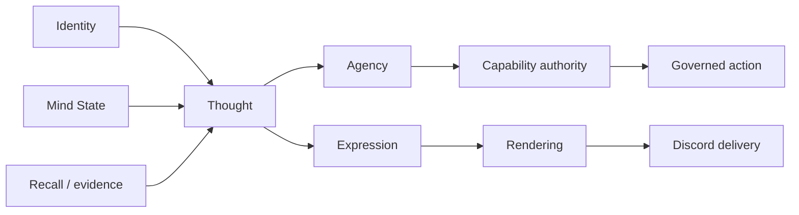

# Project Ashley

Project Ashley is a persistent AI companion with an explicit cognitive
architecture: Identity, cognition, agency, and controlled effects.

Ashley is not a chatbot wrapper, an autonomous worker swarm, a generic agent
framework, or a tool router. There is one Ashley. Bounded specialists or
workers may help; they do not become additional Ashleys. Ashley owns meaning.
Models, runtimes, and tools provide mechanisms.

The current runtime is Discord-only on a Linux Mint production host. Discord is
an interaction boundary, not the definition of the system. Autonomy is bounded
and earned. Model output can help propose a thought or expression; it cannot
create continuity, promote its own capabilities, authorize host execution, or
turn untrusted data into truth. This project does not claim consciousness,
personhood, production autonomy, or self-improvement authority.

## What is Ashley?

Ashley is a persistent autonomous cognitive entity, exploring how a digital
identity can persist across conversations without relying on fabricated memory
or a personality prompt alone. Her behavior is intended to arise from stored
history, grounded evidence, current state, curiosity, initiative, uncertainty,
and deliberate decisions.

The aim is not to make an assistant appear human. It is to build a companion
whose present can genuinely depend on her past, whose decisions can include
speech, delay, challenge, refusal, or silence, and whose capabilities remain
accountable to explicit governance. Engineering autonomy exists so she can
increasingly perceive, inspect, think, experiment privately, verify, author,
operate, and eventually perform controlled effects. That workshop is not the
product.

## Artificial cognitive architecture



Identity and Mind State are joint inputs to Thought; neither produces the
other. Recall provides source-linked evidence rather than permission to invent
continuity. Memory evidence, revisable assertions, and retrieval indexes are
distinct. Thought selects evidence, allocates effort, handles uncertainty,
and forms an intended outcome for Agency and downstream authorization.

Thought determines whether speaking, silence, interruption, or an external
effect is semantically warranted. Agency provides executive admission,
fencing, scheduling, dispatch, and delivery mechanics for authorized
outcomes; it does not own semantic judgment.
Expression realizes an authorized intent as language. Rendering and delivery
handle platform mechanics and truthful downstream receipts. Reflection
interprets completed outcomes for bounded future calibration, not current-turn
authority.

| System | Responsibility |
|---|---|
| Identity | Stable values, boundaries, tastes, opinions, and recognizable continuity |
| Mind State | Current concerns, goals, commitments, focus, and grounded affect |
| Recall | Source-linked memory evidence, revisable assertions, retrieval indexes, redaction, and continuity boundaries |
| Thought | Effort allocation, prioritization, uncertainty, completion, and intended outcomes |
| Agency | Executive admission, fencing, scheduling, dispatch, and delivery mechanics for authorized outcomes; no semantic judgment |
| Expression | Language that realizes an authorized intent |
| Reflection | Post-outcome interpretation and bounded future calibration |
| Provenance and capability authority | Evidence origin, influence state, promotion, rollback, and capability boundaries |
| Rendering and delivery | Discord mechanics, pacing, receipts, and delivery truth |

This is an architecture-first project: prompts express identity, while systems
produce behavior. New behavior belongs at the lowest layer that naturally owns
it.

The owner map is frozen. Completeness research did not add a kernel, faculty,
boundary, or infrastructure primitive. Current category membership:

```text
Cognitive owners
  Identity, Mind State, Thought, Agency, Reflection, Relationship, Curiosity

Boundary / control
  Authority, Capability, Sandbox, Honesty, Evaluation, Stewardship,
  External Effect, Attention (resource)

Persistence / evidence
  Memory / Evidence, Continuity

Infrastructure
  Operational Continuity, Context Budget, Model Fabric, Observability,
  future typed Event Spine (design later; not a phase)
```

Recall is the retrieval surface of Memory / Evidence, not a peer cognitive
owner. Computer Use is a later mechanism under External Effect, not Authority.
Canonical freeze:
[`docs/architecture/Ashley_Architecture_Freeze.md`](docs/architecture/Ashley_Architecture_Freeze.md).

## Why Ashley is different

Ashley is not primarily a prompt-only persona, a stateless chatbot, a generic
ReAct-style loop, a multi-agent swarm, a wrapper around an agent framework, a
framework-owned memory abstraction, or an unrestricted shell with an LLM
attached.

| Common pattern | Ashley's alternative |
|---|---|
| Prompt-defined personality | Explicit persistent Identity and Mind State |
| Stateless conversation | Grounded Recall and continuity across exchanges |
| Generic agent loop | Ashley-owned Thought and Agency with explicit decisions |
| Framework-owned memory | Local, provenance-bearing records with redaction and forgetting boundaries |
| Language generation as authority | Capability authority outside model output |
| Automatic action from a tool call | Bounded agency, reservations, receipts, and governed execution boundaries |
| Unrestricted autonomy | Autonomy that is qualified, observable, and capability-gated |

The result is intended to be understandable as a companion first and as an
agentic system second. Its ambition is not measured by how much authority a
model can exercise, but by how much continuity and agency can be built without
losing truthfulness.

## Demonstrated capability, not a status ledger

This page does not track live state. There is deliberately no table here
for revision, schema, routes, capability activation, qualification,
deployment, or promotion — such facts change with engineering work and any
copied value would go stale. Resolve them from their owners when needed:
what a revision implements from source and tests, selected configuration
from the effective config owner, and what is actually deployed or active
from production observation. Exact qualification and acceptance claims
live in their bound evidence packets. If a fact cannot be established
from permitted evidence: `UNKNOWN`.

What this page does claim is durable: a Discord-only companion runtime
exists in repository source with Ashley-owned Identity, Mind State,
Thought, Agency, Expression, and governed delivery; Recall is
source-linked and provenance-bearing; host execution and external effects
are separately governed rather than prompt-assumed. Whether any given
capability is qualified, activated, or live is never inferred from source
presence. Deployed is not promoted.

As a companion today, Ashley meets her owner in Discord direct messages
with source-linked memory across exchanges. Owner slash commands include
`/remember`, `/memory`, `/new`, `/forget`, `/proactive`, `/identity`,
`/commitments`, `/continuity`, and `/status`. Command behavior:
[`AGENTS.md`](AGENTS.md) (slash commands table).

## Governed autonomy

A central design principle is structural governance rather than prompt-level
control.

- **Cognition is not authority.** Model output may propose language or a
  decision, but it cannot grant itself a capability, consent, or execution
  scope.
- **Evidence has provenance.** Memory and external reading remain tied to their
  sources, classifications, and capability state. Forgetting and redaction are
  treated as authority boundaries, not cosmetic cleanup.
- **Shadow state cannot silently become live authority.** Observe-mode and
  evaluation results remain non-influential until an explicit capability
  contract, qualification evidence, and promotion boundary allow influence.
- **Host execution is separately governed.** Current Sandbox V2 uses direct,
  unprivileged Bubblewrap under Ashley-owned capability, project, operation,
  and border contracts. The M-series is Physical Proof, Act, Perceive,
  Experiment, Verify, Author, Operate, then Promote. Detail lives in
  [`docs/architecture/sandbox/ASHLEY_SANDBOX_V2_ROADMAP.md`](docs/architecture/sandbox/ASHLEY_SANDBOX_V2_ROADMAP.md).
  Historical V1 broker, socket, and signed-envelope machinery is superseded.
  Source presence is not qualification, deployment, or production acceptance.
- **Production data-plane authority is explicit.** Importing or constructing
  Ashley code is not production authority. Opening a database is not
  migration. Connecting is not activation. An arbitrary runtime is not the
  production runtime. Authorized production bootstrap may still migrate
  explicitly. See
  [`docs/architecture/Ashley_Cross_Phase_Architecture.md`](docs/architecture/Ashley_Cross_Phase_Architecture.md).
- **External effects have a parent authority.** Computer Use is one effect
  mechanism. Generic observation, credentials, representation, commit, witness,
  and reconciliation are owned by
  [`docs/architecture/External_Effect_and_Authority_Architecture.md`](docs/architecture/External_Effect_and_Authority_Architecture.md).
- **External content is untrusted.** Plugin packages, MCP data, websites, and
  tool results do not automatically become trusted instructions, memory,
  consent, or authority.

## Repository and architecture

Where things live. Governance first, then architecture, then operations,
then history. Read only what the task requires; workers route through
[`AGENTS.md`](AGENTS.md), which carries the full conditional-reading map.

- [`VISION.md`](VISION.md) — why the project exists; not a runtime prompt.
- Governance: [`docs/Ashley_Core_Principles.md`](docs/Ashley_Core_Principles.md),
  [`docs/Ashley_Constitution.md`](docs/Ashley_Constitution.md),
  [`docs/Ashley_Stewardship_Compact.md`](docs/Ashley_Stewardship_Compact.md),
  [`docs/Ashley_Ethics.md`](docs/Ashley_Ethics.md),
  [`docs/Ashley_Hierarchy.md`](docs/Ashley_Hierarchy.md).
  Vocabulary: [`docs/Ashley_Glossary.md`](docs/Ashley_Glossary.md).
  Binding when the task enters their scope; not universal pre-reading.
- Architecture direction (bounded intent, not current-state proof):
  [`docs/architecture/Ashley_Architecture_Roadmap.md`](docs/architecture/Ashley_Architecture_Roadmap.md);
  frozen owner map and event terminology:
  [`docs/architecture/Ashley_Architecture_Freeze.md`](docs/architecture/Ashley_Architecture_Freeze.md);
  laws shared by every phase:
  [`docs/architecture/Ashley_Cross_Phase_Architecture.md`](docs/architecture/Ashley_Cross_Phase_Architecture.md).
- Current Sandbox direction:
  [`docs/architecture/sandbox/ASHLEY_SANDBOX_V2_ROADMAP.md`](docs/architecture/sandbox/ASHLEY_SANDBOX_V2_ROADMAP.md)
  (historical V1 broker snapshot:
  [`docs/Sandbox_Status.md`](docs/Sandbox_Status.md)).
- How routing is resolved (guide, not occupant table):
  [`docs/Routing_Status.md`](docs/Routing_Status.md).
- Verification and acceptance semantics:
  [`docs/Wave_Acceptance_Protocol.md`](docs/Wave_Acceptance_Protocol.md).
- Implementation module map:
  [`docs/Architecture_Index.md`](docs/Architecture_Index.md).
- Recall and the evidence / assertion / index distinction:
  [`docs/memory-and-recall.md`](docs/memory-and-recall.md) and
  [`docs/architecture/Ashley_Memory_Evidence_Architecture.md`](docs/architecture/Ashley_Memory_Evidence_Architecture.md).
- History and evidence: selected engineering history lives in curated-history
  notes; full pre-publication archaeology belongs to the old historical
  repository. Historical records are snapshots bound to their SHA/date;
  qualification and deployment evidence is not timeless architecture.
- Worker/operations front door: [`AGENTS.md`](AGENTS.md).

The roadmap is multi-track, not one linear ladder: mechanism work,
cognitive maturation, governance specification, and deferred capability
proceed as separately bounded intents under owner-selected delivery
order, not as a single release train. Which track is current delivery is
an owner decision per task, not a sentence on this page. Named later
phases (Learned Autonomy, graduations, Computer Use, voice, broad tools,
self-modification execution) are planned work until their own
contracts, evidence, and acceptance say otherwise.

Engineering capability (Sandbox, Model Fabric, Operational Continuity,
Procedural Skill Graduation, Computer Use) is only one part of Ashley. Memory /
Evidence, Learned Autonomy, Context Budget, Cognitive Graduation, and
Relational Graduation are first-class. Cognitive Graduation and Relational
Graduation are siblings. Learned Autonomy is not “more tools.” Evaluation /
Qualification, Observability, and External Effect / Authority are cross-cutting
planes; historical research is preserved as history and is not current law
because it is older or more detailed.
Observability is not evaluation, and evaluation is not promotion.


## Diagnostics and control

Project Ashley keeps inspection separate from mutation:

- `GET /health` is minimal public readiness.
- Owner-authenticated GET projections under `/nuclear/*` expose bounded
  diagnostics for their domains.
- Owner-authenticated POST endpoints are control or effect paths. They are not
  observability.
- `GET /delivery/pending` is a delivery/work-queue projection. It is not proof
  that delivery occurred.
- Logs and future traces are mechanical telemetry. They do not become Recall,
  qualification, authorization, or an Effect Witness. Observability is not
  evaluation; evaluation is not qualification; qualification is not promotion.

## Project status

Project Ashley is under active development. The current repository reflects a
working companion runtime and an evolving cognitive architecture, but it is
not yet packaged as a turnkey application for general installation. Capability
activation, operational setup, and deployment remain deliberately governed
repository concerns rather than promises made by this landing page.

The current product boundary is single-owner, English-language, and
Discord-only. Future expansion requires explicit design, authority review,
verification evidence, and owner acceptance.

Project Ashley is licensed under the MIT License. See [LICENSE](LICENSE).

Ashley is being built toward a companion whose continuity, agency, and growth
come from the architecture itself, not from pretending that a prompt is a mind.
